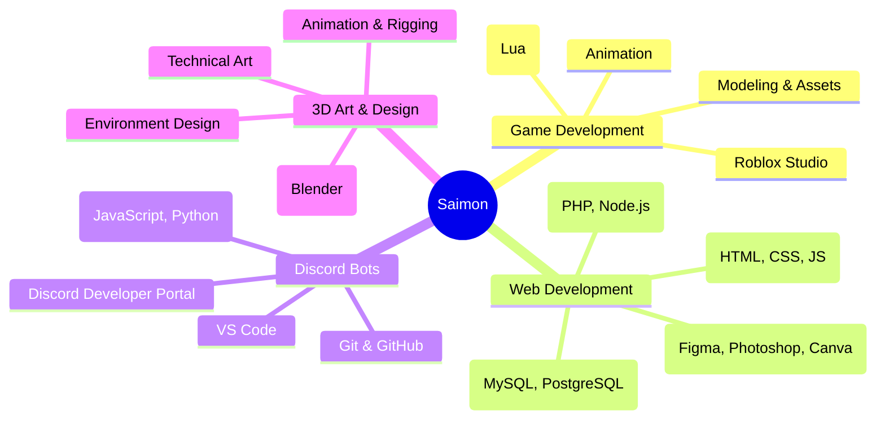

<h1 align="center">
    
</h1>

# 💫 About Me:
**Hey, I'm Saimon. a passionate web dev, Roblox game creator, and Discord bots dev. I enjoy working on creative ideas and turning them into real, functional projects. I'm always exploring new techs, improving my skills, and pushing my limits to build better stuff every day. Currently focusing on web apps, game scripts, and automation projects**.

---

## 🌐 Socials:

---

## 🛠️ Tech Arsenal:

### 💻 Languages:

### 🎮 Roblox games

### 🤖 Discord bots

### 🌐 Website

---

## 📊 GitHub Analytics

<table>
<tr>
<td width="50%">

</td>
<td width="50%">

</td>
</tr>
</table>

### 🏆 GitHub Trophies

---

## 🌟 Professional Focus Areas

---

## 🎯 Current Focus

| 🔥 **Currently Working On** | 🎓 **Learning** | 🎯 **Goals 2025** |
|:---|:---|:---|
| Nothing | Nothing | Nothing |
| Nothing | Nothing | Nothing |
| Nothing | Nothing | Nothing |

---

## 📈 Contribution Activity

---

---

## 💰 Donating, TY <3 :

---

---

  

